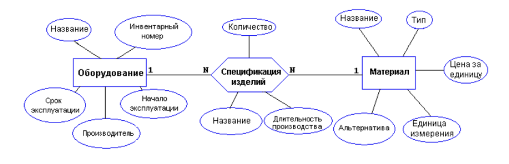

# Final course project

Choosen stack was Javascript + Sequelize as ORM (as it was required, but i left raw sql code comments of the queries preformed by the ORM)
Scope was pre defined by my luck, Manufacturing.

## Description

( this all will be in russian, I didn't bother with translating )

### Дано

- вариант с первого модуля в качестве основы для области знаний.

### Цель

- написать простое приложение, предоставляющее REST API, которое бы использовало базу данных в своей основе.

#### Обязательное требование к оформлению задания, иначе задание не принимается

- ход решения должен быть зафиксирован в системе контроля субверсий (по умолчанию git, но если знаете что-то ещё используйте что хотите).
- Коммитом должен сопровождаться каждый день, в который они хоть что-то там меняли, вне зависимости от того работает оно или нет.

Предлагаемые технологии: FastAPI, Sqlalchemy, Alembic (и всё что около того). С момента объявления задания у вас есть неделя (максимум 2), чтобы заявить о желании использовать другие технологии

### Критерии оценки

[x]. (5 баллов) - написать скрипт инициализации базы (создание базы данных с определенным именем, установка владельца базы):
(cmd/init.js)

[x]. (15 баллов) - продумать REST API в зависимости от темы и написать программу, реализующую базовый CRUD (crud ready with validation and paginated get)

[ ]. (15 баллов) - заполнить бд большим количеством данных с помощью скрипта, который взаимодействует с бд через REST API вашего приложения

[x]. (10 баллов) - создать и добавить хотя бы 2 миграции данных (добавление новых колонок и построение индексов при помощи миграций) (db/migrations/add-indexes)

[50/50]. (25 баллов) - составить  следующие разновидности запросов, подходящих для вашей темы и реализовать их в виде вызовов REST API (по 5 баллов каждый):
— SELECT ... WHERE (с несколькими условиями)
— JOIN
— UPDATE с нетривиальным условием
— GROUP BY
— добавить к параметрам запросов в API сортировку выдачи результатов по какому-то из полей
(For now, queries are placed in queries.sql until i place them in api, but it doesn't make sense given we use ORM and raw query writing skills are not used in that, sorting is supported in crud)

[ ]. (20 баллов) - создать JSON-поле, наполнить его данными, построить над ним pg_trgm + GIN индекс, реализовать полнотекстовый поиск по регулярному выражению из синтаксиса psql в виде REST API запроса

[x]. (10 баллов) - использование ORM (Sequelize is used)

[x]. (10 баллов) - использование пагинации (All list gets support pagination)

[ ]. (10 баллов) - создать простенький ui
